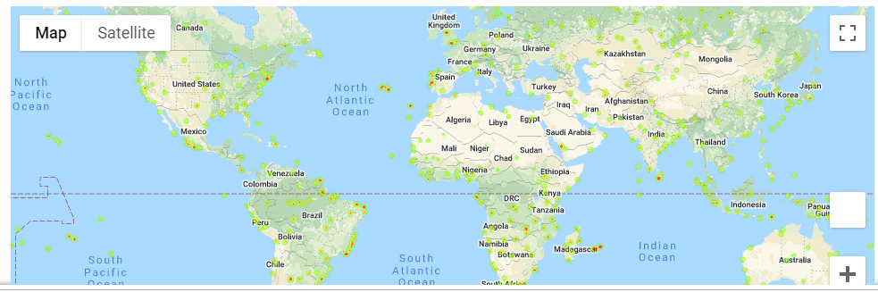
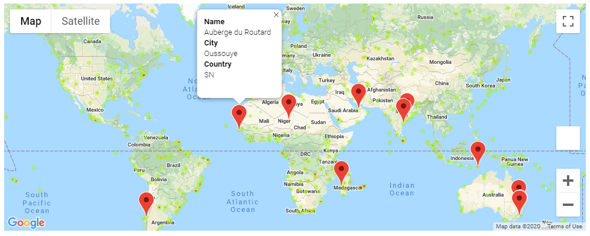

# Project Background and Objectives
You'll be creating a Python script to visualize the weather of 500+ cities across the world of varying distance from the equator. To accomplish this, you'll be utilizing a simple Python library, the OpenWeatherMap API, and a little common sense to create a representative model of weather across world cities. Then use your skills in working with weather data to plan future vacations using jupyter-gmaps and the Google Places API.

# WeatherPy analyses and output
Analyses are included throughout the WeatherPy.ipynb file in the WeatherPy folder in this repo. CSV of all retrieved data and a PNG image for each scatter plot are also included in the same folder.

# Screenshots of VacationPy output

Heatmap

Heatmap with markers and info boxes

